# :floppy_disk: Tech4You :floppy_disk:

## Tabela de Conteúdos

- [Tabela de Conteúdos](#tabela-de-conteúdos)
- [Âmbito](#âmbito)
- [Visão Geral](#visão-geral)
    - [Home Page](#home-page)
    - [Dashboard Page](#dashboard-page)
        - [Details](#details)
        - [Purchases](#purchases)
        - [Sales](#sales)
        - [Sales Invoices](#sales-invoices)
        - [Accounts](#accounts)
        - [Customers](#customers)
        - [Suppliers](#suppliers)
        - [Products](#products)
        - [Taxes](#taxes)
- [Ferramentas](#ferramentas)
	- [Documentação](#documentação)
	- [Comunicação](#comunicação)
	- [Controlo de Versões](#controlo-de-versões)
	- [Gestão da Empresa](#gestão-da-empresa)
	- [Aplicação Web](#aplicação-web)
- [Autores](#autores)
	
## Âmbito

Projeto realizado na época de recurso de 2020 no âmbito da unidade curricular de **Sistemas de Informação Organizacionais** da **Licenciatura em Engenharia Informática** da **Escola Superior de Tecnologia e Gestão - P.Porto**.

## Visão Geral

### Home

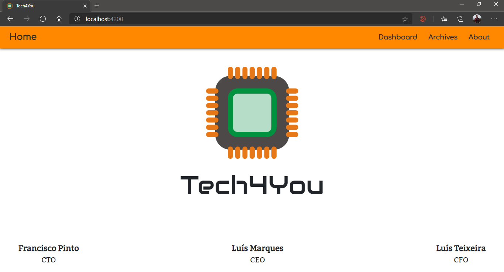

### Dashboard

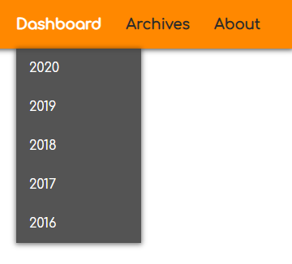

#### Business Transactions

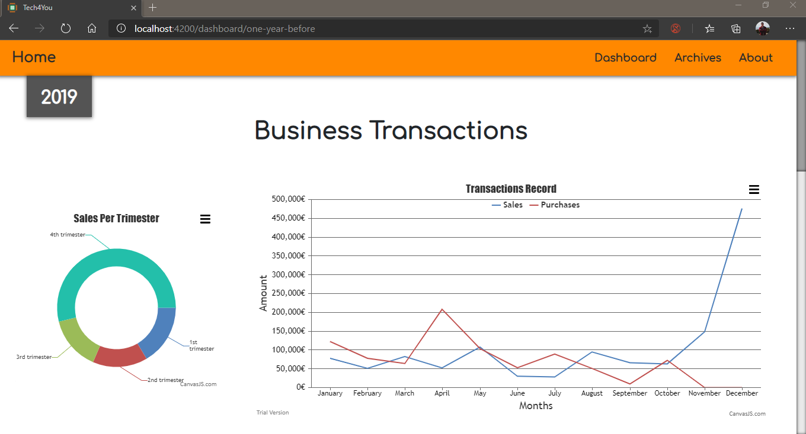

#### Product Sales

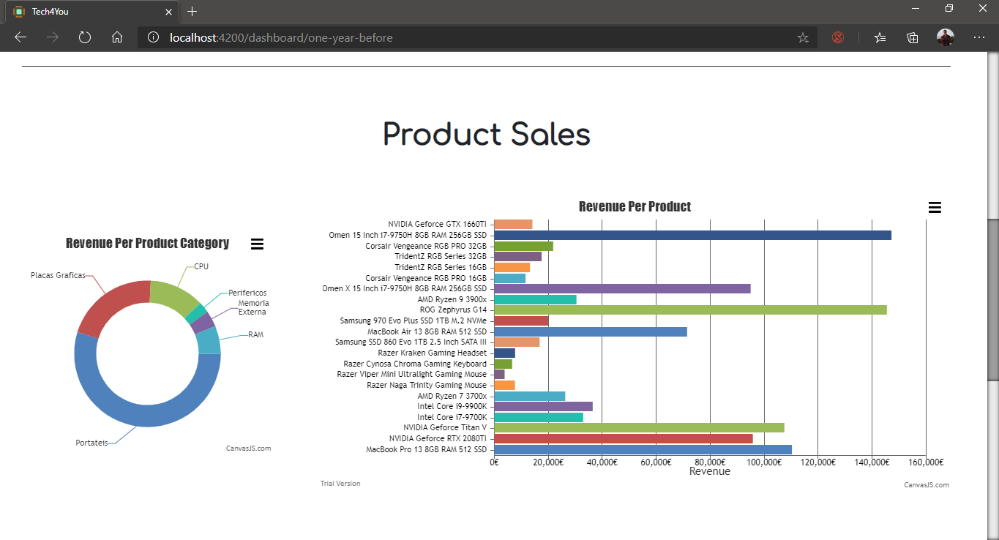

#### Sales Per Customer

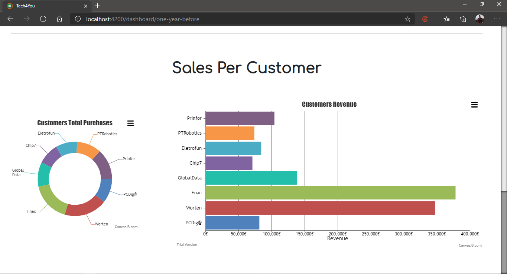

#### 2020

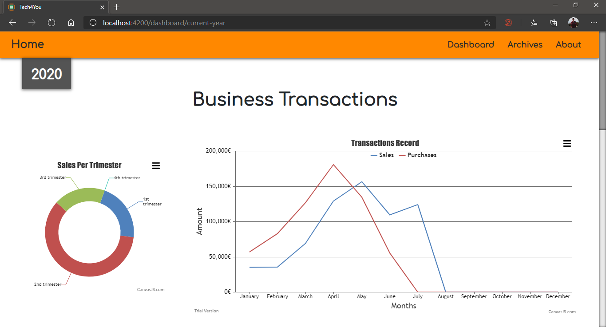

#### 2019

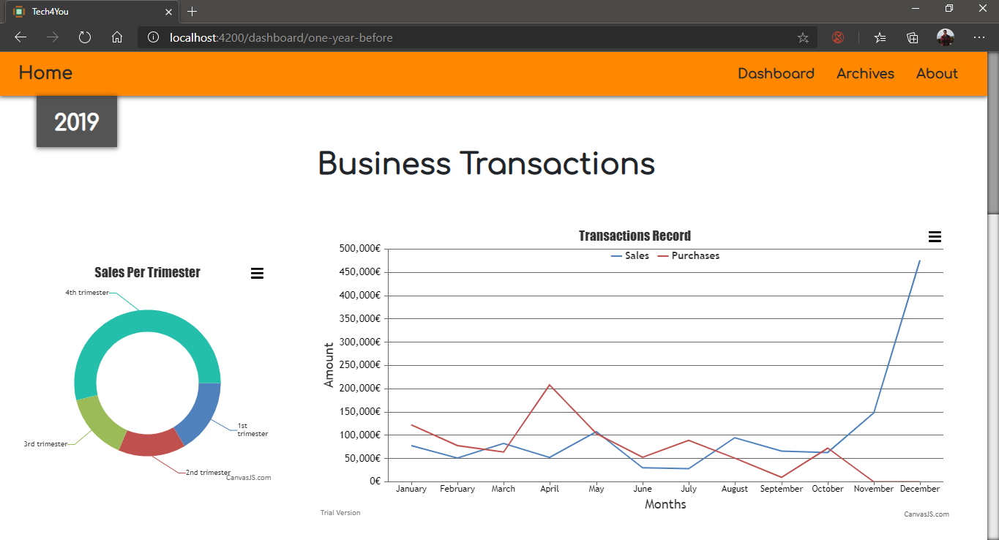

#### 2018

#### 2017

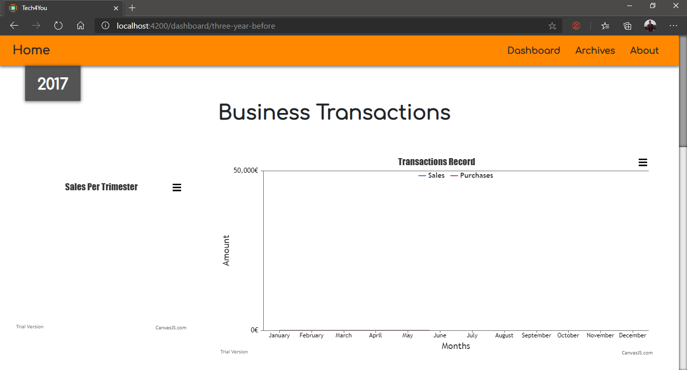

#### 2016

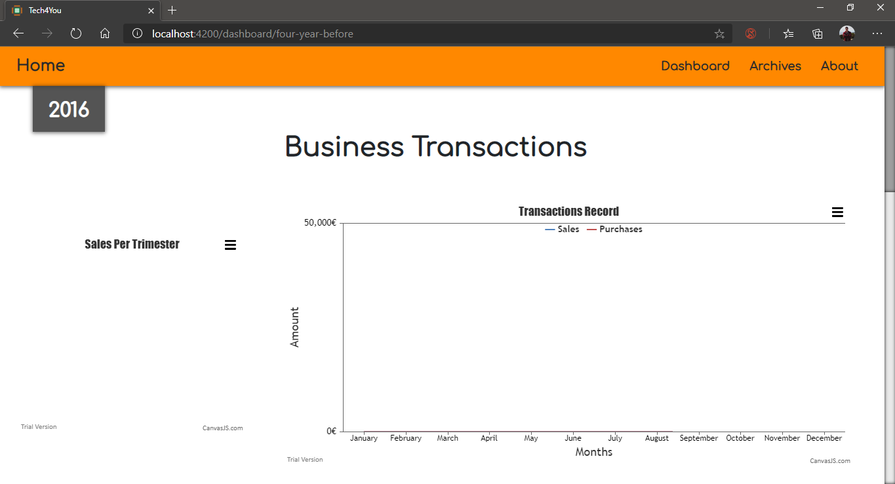

### Archives

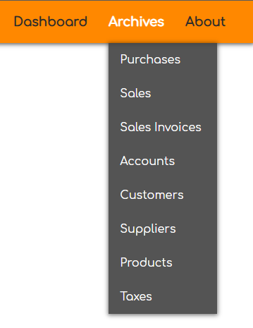

#### Purchases

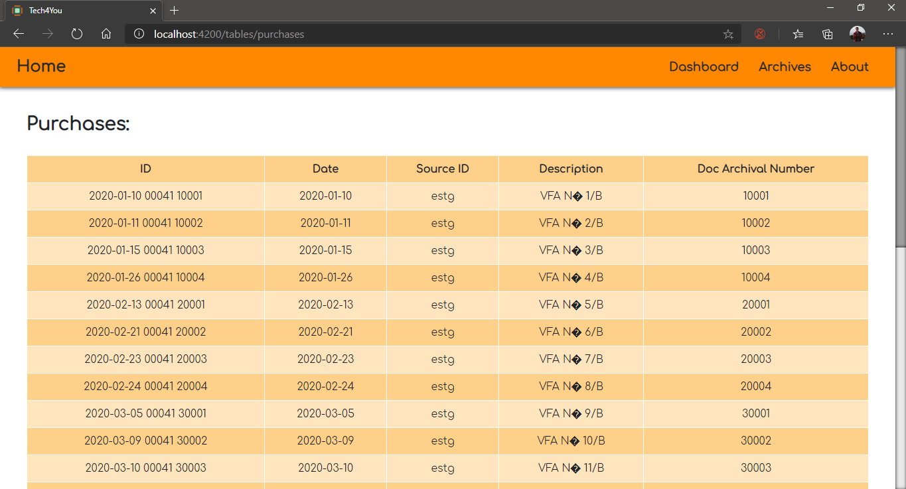

#### Sales

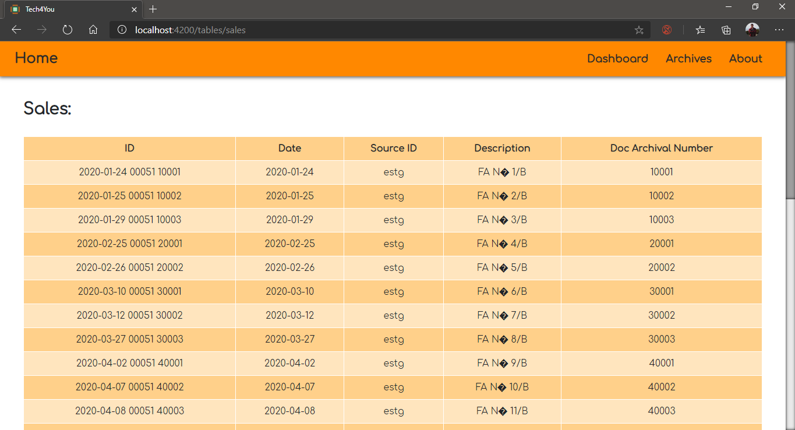

#### Sales Invoices

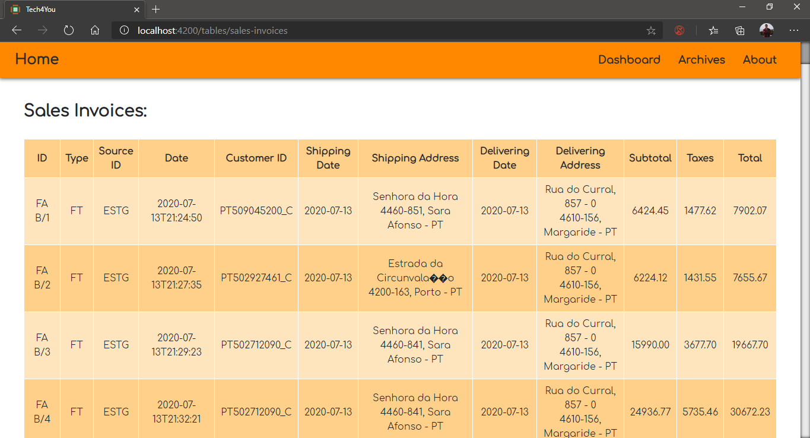

#### Accounts

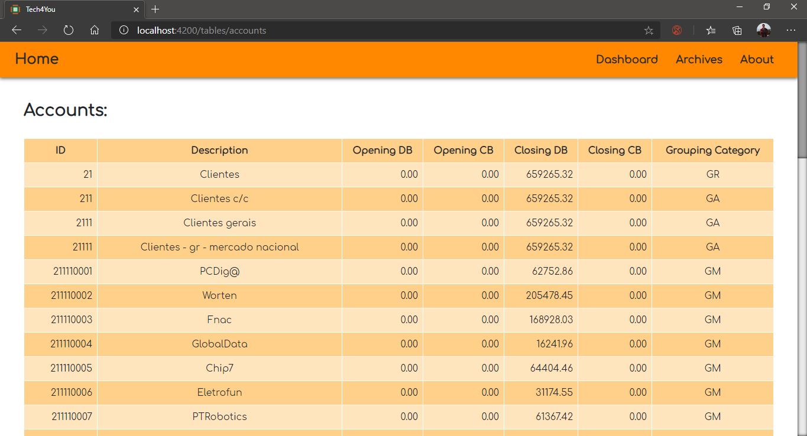

#### Customers

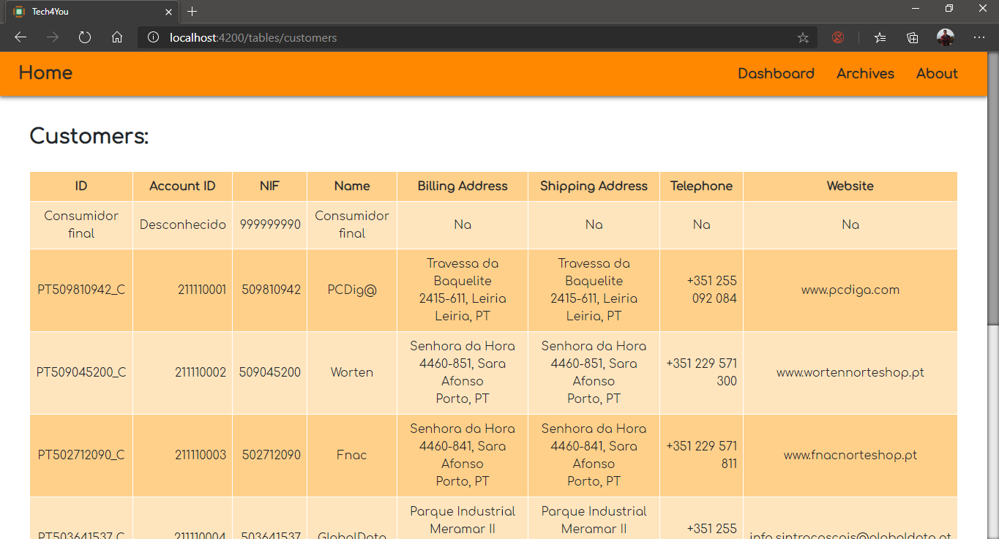

#### Suppliers

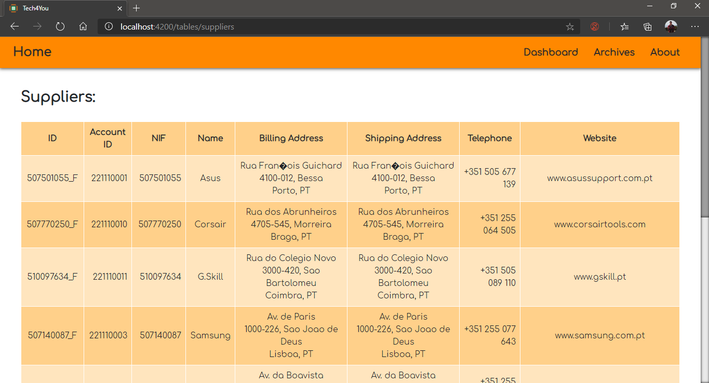

#### Products

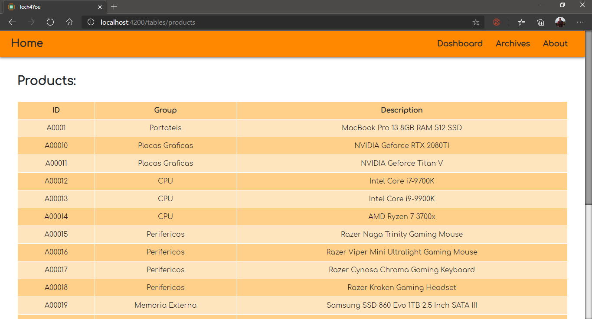

#### Taxes

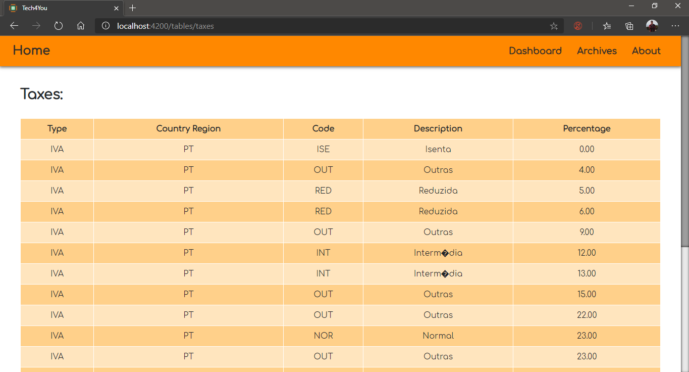

### About

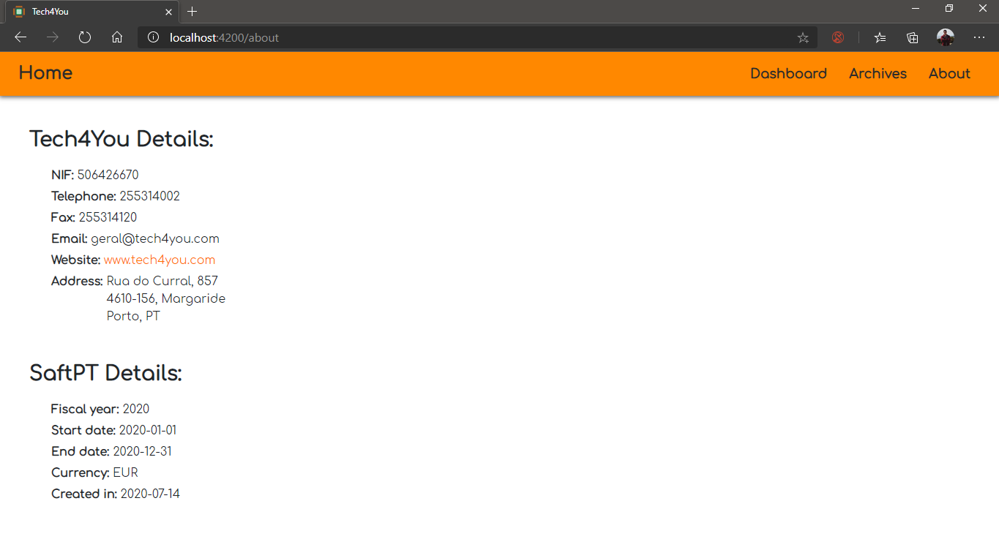

## Ferramentas

### Documentação

- [MS Office Word](https://www.microsoft.com/pt-pt/microsoft-365/word) - Desenvolvimento do relatório final

### Comunicação

- [Facebook Messenger](https://www.messenger.com/) - Comunicação informal entre os membros da equipa
- [MS Teams](https://teams.microsoft.com/) - Comunicação formal entre os membros da equipa

### Controlo de Versões

- [GitHub](https://github.com/) - Controlo de versões

### Gestão da Empresa

- [Primavera ERP](https://pt.primaverabss.com/pt/) - ERP utilizado
- [VirtualBox](https://www.virtualbox.org/) - Virtualização da máquina da empresa

### Aplicação Web

- [MS Visual Studio Code](https://code.visualstudio.com/) - IDE para desenvolvimento
- [NodeJS](https://nodejs.org/en/) - Framework para backend
- [Angular](https://angular.io/) - Framework para frontend
- [Postman](https://www.postman.com/) - Plataforma de testes da RESTAPI
- [MongoDB](https://www.mongodb.com/) - Base de dados
- [MongoDB Compass](https://www.mongodb.com/products/compass) - Gestor da base de dados com interface visual

## Autores

- **Francisco Pinto** - 8170580 - [RedByte2101](https://github.com/RedByte2101)
- **Luis Marques** - 8170485 - [LuisMarques99](https://github.com/LuisMarques99)
- **Luis Teixeira** - 8110156 - [luisteixeira92](https://github.com/luisteixeira92)
